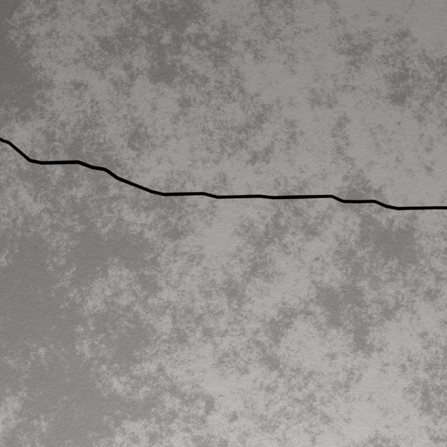
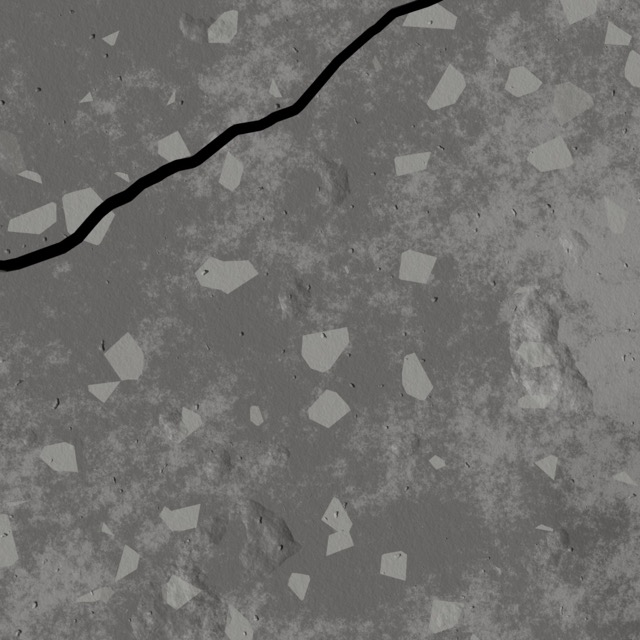
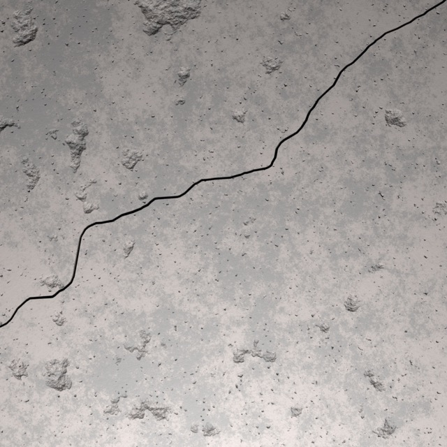
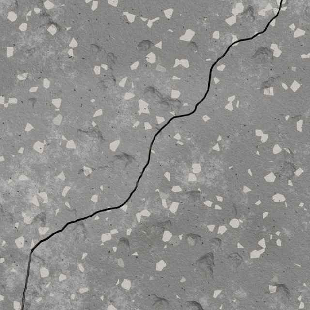

# MetroDef3D

Greenfield dataset generator for metrologically grounded surface defect data.

The current slice provides:

- YAML scene recipe loading and validation.
- Deterministic planar surface and crack construction from explicit seeds.
- `metrodef3d validate` and `metrodef3d generate` CLI commands.
- JSON metadata export preserving construction measurands.
- A lightweight preview renderer that writes a PPM image without Blender.
- A Blender render backend that generates a scene script and invokes Blender
  headlessly when a Blender executable is available.
- Capture passes so one constructed crack seed can produce multiple camera and
  illumination outputs.
- Dataset-style outputs grouped by artifact type, with seed-number filenames:
  `img/`, `json/`, `yaml/`, `blender_script/`, and `blend/`.

## Demonstration Dataset

MetroDef3D Simple Concrete Crack Dataset v1.0 demonstrates the generator
through 10,000 published observations with construction references and
associated metadata. It is available on Zenodo under CC BY 4.0 at
[DOI 10.5281/zenodo.21340378](https://doi.org/10.5281/zenodo.21340378).

Example rendered samples with corresponding visible-defect measurands:

| Seed | Render | Visible centerline length (mm) | Mean width (mm) | Max width (mm) | Crack area (mm^2) |
| ---: | --- | ---: | ---: | ---: | ---: |
| `12347` |  | 71.947761 | 0.555277 | 0.615713 | 39.950925 |
| `12348` |  | 61.241552 | 1.336043 | 1.526400 | 81.821334 |
| `12363` |  | 180.544846 | 0.746926 | 0.866567 | 134.853684 |
| `12365` |  | 199.584764 | 0.855409 | 0.999020 | 170.726505 |

These numbers come from the per-capture `visible_defect` construction metadata,
not from measuring the rendered pixels.

Blender is currently used as the author's chosen rendering backend. It is not
part of the metrological definition of the defect. Any suitable rendering engine
or scene software can be used if it preserves the same construction-defined
defect geometry, camera model, illumination setup, units, and exported truth
metadata.

Default scene conventions:

- One Blender unit is treated as one millimeter.
- The Blender example surface is 250 x 250 mm with 1000 mm block depth.
- The default camera is orthographic, looking normal to the surface, with the
  image plane parallel to the surface.
- The default orthographic field is 150 x 150 mm when using square resolution.
- V1 crack length must be at least 10 mm.
- The default crack skeleton step is 0.2 mm. A 240 mm crack therefore has
  1201 centerline points. Crack morphology is generated on a coarser
  `path_control_step` and then arc-length resampled onto the dense skeleton.
- When no crack center is specified, the center is sampled inside the 20-80%
  range of the first capture's orthographic field.
- Generated cracks use a directed random walk with random orientation, small
  heading drift, minor and major kinks at separately sampled distance
  intervals, forward progress checks, and a self-intersection guard. The default
  `path_control_step` preserves plausible coarse shape while the 0.2 mm skeleton
  preserves metrological sampling. If cracks cross outside the field of view,
  per-capture `visible_defect` metadata stores clipped centerline profiles and
  measurands for only the rendered portion.
- Crack width varies per seed via `defect.width_variation`. Metadata records
  the sampled `width_multiplier`, `effective_nominal_width`, and smooth
  `fbm_1d` width-field parameters. The field modulates width along crack
  length instead of applying independent per-point jitter.

Crack construction models:

- `ribbon_fbm_width` is the metrology-first cut/profile model and the default
  path for the Blender example. The crack skeleton and the width profile define
  the left and right truth boundaries directly. Length, local width, area,
  station profile, and arbitrary-point width queries can be read from the
  construction metadata without re-estimating geometry from the render.
- `split_displacement` is retained as an optional realism-oriented generator.
  It splits the surface into two bodies and moves them apart, with optional
  render-side edge falloff and debris. This can produce plausible split-surface
  appearances, but it is not the preferred V1 metrological dataset path because
  richer split geometry can make the final centerline/width definition more
  method-dependent.

Example:

```sh
PYTHONPATH=src python3 -m metrodef3d validate --config examples/cracked_plane.yaml
PYTHONPATH=src python3 -m metrodef3d generate --config examples/cracked_plane.yaml --out runs/example
```

Blender example:

```sh
PYTHONPATH=src python3 -m metrodef3d validate --config examples/cracked_plane_blender.yaml
PYTHONPATH=src python3 -m metrodef3d generate --config examples/cracked_plane_blender.yaml --out runs/blender-example
```

Optional split-geometry Blender example:

```sh
PYTHONPATH=src python3 -m metrodef3d validate --config examples/cracked_plane_blender_split.yaml
PYTHONPATH=src python3 -m metrodef3d generate --config examples/cracked_plane_blender_split.yaml --out runs/blender-split-example
```

Generate multiple seed variants from one recipe:

```sh
PYTHONPATH=src python3 -m metrodef3d generate \
  --config examples/cracked_plane_blender.yaml \
  --out runs/blender-variance \
  --count 10
```

For a multi-capture Blender recipe this writes:

```text
runs/blender-variance/img/overhead-area/12345.jpg
runs/blender-variance/img/perspective-area/12345.jpg
runs/blender-variance/json/12345.json
runs/blender-variance/yaml/12345.yaml
runs/blender-variance/blender_script/overhead-area/12345.py
runs/blender-variance/blender_script/perspective-area/12345.py
runs/blender-variance/blend/overhead-area/12345.blend
runs/blender-variance/blend/perspective-area/12345.blend
```

The Blender backend expects `blender` on `PATH`. You can point at a specific
binary with:

```yaml
render:
  backend: blender
  image_format: jpg
  executable: /path/to/blender
```

Multiple capture passes can be declared with:

```yaml
captures:
  -
    id: overhead-area
    camera:
      type: orthographic
      orthographic_scale: 150.0
      resolution: [1024, 1024]
    lighting:
      type: area
      position: [0.0, 0.0, 250.0]
      energy: 500000.0
      size: 150.0
  -
    id: perspective-area
    camera:
      type: perspective
      position: [0.0, 0.0, 500.0]
      target: [0.0, 0.0, 0.0]
      fov_degrees: 17.061531
      resolution: [1024, 1024]
    lighting:
      type: area
      position: [0.0, 0.0, 250.0]
      energy: 500000.0
      size: 150.0
```

Missing capture camera and lighting fields are filled from the defaults.

Initial ML smoke test:

```sh
python tools/train_scalar_baseline.py \
  --run-dir runs/prod_001_seeds_0001_1000 \
  --capture-id perspective-area \
  --out-dir runs/ml/prod_001_perspective_baseline \
  --epochs 25 \
  --batch-size 32
```

The baseline trains a small CNN regressor from one rendered capture stream to
the per-capture visible-defect measurands stored in JSON metadata:
`centerline_length`, `mean_width`, `max_width`, and `crack_area`. It is meant as
a fast dataset sanity check, not the final metrology model.

## Versioning

The generator uses semantic versioning. The current public generator version is
`0.1.0`.

Generated metadata records both code and schema versions:

```json
"generator": {
  "name": "metrodef3d",
  "version": "0.1.0",
  "git_commit": "<short commit hash>",
  "recipe_schema_version": 1,
  "metadata_schema_version": 1,
  "visible_defect_schema_version": 1,
  "pixel_scale_schema_version": 1
}
```

Datasets published from this generator carry a separate human-readable title
and machine identifier. The first simple concrete crack release uses:

```text
Title: MetroDef3D Simple Concrete Crack Dataset v1.0 (Seeds 1-10,000)
ID:    metrodef3d_simple_concrete_crack_v1_0_seeds_00001_10000
```

Keep the dataset version independent of the generator version. A published
dataset manifest records the dataset id and version, generator version and
commit, schema versions, seed range, generation configuration, and checksums.
Increase the dataset major version when generation or reference semantics
change incompatibly, the minor version when samples or compatible fields are
added, and the patch version for metadata-only corrections that do not alter
sample content or reference values.

## Fixed Geometry Sensitivity Study

The article's complete procedural and photographic background sensitivity
materials are available in
[`studies/fixed_geometry_background_sensitivity/`](studies/fixed_geometry_background_sensitivity/).
The package includes the inputs, all 192 renders, eight fixed references,
row-level predictions, calibrated bounds, and aggregate summaries. The study
contains eight geometries evaluated under eight procedural and 16 photographed
surface conditions per geometry. The photographic observations combine
concrete surface photographs with synthetic crack geometries. They are
controlled appearance tests rather than validation images of real cracks. An
interactive overview and per-seed browser is provided at
`studies/fixed_geometry_background_sensitivity/results/full_study/report.html`.

## Future Quality Control

The current quality manifest preserves identified construction failures for
inspection and audit. Future generator development should improve construction
reliability and add stronger automatic checks for geometry, reference values,
and rendered outputs. These checks should flag unsuitable observations during
generation so that large batches do not depend on manual image review. These
items are development targets rather than capabilities claimed for the current
generator or MetroDef3D Simple Concrete Crack Dataset v1.0.

## License

MetroDef3D uses separate licences for software and non-software materials.

| Material | Licence |
| --- | --- |
| Source code, scripts, tests, example configuration files, and software packaging | [Apache License 2.0](LICENSE) |
| Documentation, rendered and example images, reference data, study results, and other non-software materials | [Creative Commons Attribution 4.0 International](LICENSE-DATA.md) |

The CC BY 4.0 licence includes the photographed concrete surfaces and all other
materials in the fixed geometry background sensitivity study. Copyright in
these photographs is held by Henri Vennikas. Any material identified as third
party content remains subject to its stated licence.

MetroDef3D Simple Concrete Crack Dataset v1.0 is separately published on Zenodo
under CC BY 4.0 at <https://doi.org/10.5281/zenodo.21340378>.
